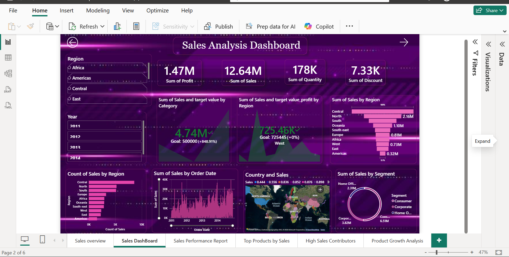

# Sales Analysis Dashboard — Power BI Project

## 📊 Overview
This *Sales Analysis Dashboard* provides a comprehensive view of company sales performance across multiple regions, segments, and years.  
It is designed using *Microsoft Power BI* to track key performance metrics and uncover insights that support data-driven decisions.

---

## 🎯 Objectives
- To analyze *total sales, profit, and discount trends*.
- To identify *top-performing regions, segments, and categories*.
- To monitor *year-wise growth* and *target achievements*.
- To visualize *global sales distribution* interactively.

## 🧠 Key Insights
- 💰 *Total Sales:* 12.64M  
- 💹 *Total Profit:* 1.47M  
- 📦 *Quantity Sold:* 178K  
- 🎁 *Total Discount:* 7.33K  

### Highlights:
- *Central region* recorded the highest sales (2.16M).  
- *Consumer segment* contributed the largest share of total sales.  
- *2014* marked a strong sales growth compared to previous years.  
- The *Sales vs Target analysis* shows exceptional goal achievement (848.91%).  
- Global map visualization shows strong market presence in *North America, Europe, and Africa*.

## 🧰 Tools & Technologies Used
| Tool | Purpose |
|------|----------
| *Power BI* | Data Visualization & Dashboard Design |
| *Microsoft Excel* | Data Cleaning & Preprocessing |
| *DAX* | KPI Calculations and Measures |
| *Map Visualization* | Geographic Sales Analysis |

---

## 📂 Dataset Information
- *Dataset Source:* Sample Sales Dataset (Excel format)  
- *Data Fields:* Region, Country, Segment, Category, Sales, Profit, Quantity, Discount, Year, Order Date  
- *Data Cleaning:* Performed in Excel before importing to Power BI.

---

## 📈 Dashboard Features
- *KPIs:* Profit, Sales, Quantity, Discount  
- *Interactive Filters:* Year, Region, Segment  
- *Visuals Used:*
  - KPI Cards  
  - Line Chart (Sales by Order Date)  
  - Bar Chart (Sales by Region & Count of Sales)  
  - Donut Chart (Sales by Segment)  
  - Map (Country-wise Sales)  
  - Goal Tracker (Sales vs Target)

---

## 🖼️ Dashboard Preview

## 💡 Learnings
- Created and customized visuals in *Power BI*.
- Used *DAX Measures* to calculate KPIs and targets.
- Built an *interactive and visually appealing dashboard*.
- Improved understanding of *sales trends and performance metrics*.

---

## ⚖️ License
This project is licensed under the *MIT License* — see the [LICENSE](./LICENSE) file for details.

---

## ✨ Author
*Sri Gobika R*  
📧 Feel free to connect via [LinkedIn](https://www.linkedin.com/in/srigobika)

---
